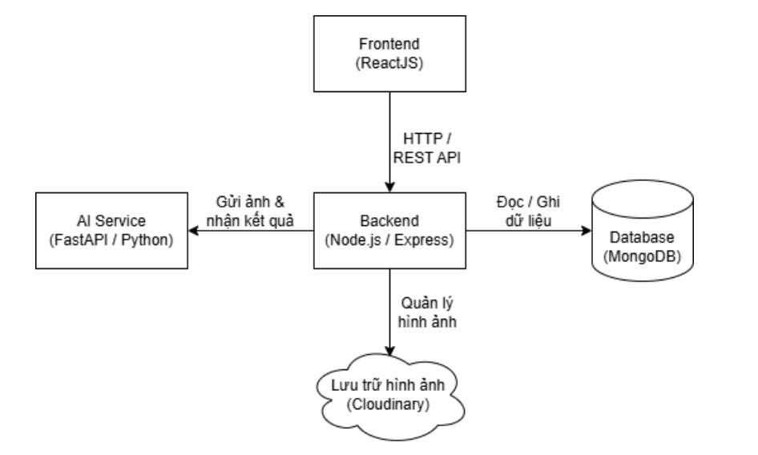

# Animal Explorer

A web application that uses AI to identify animal species from uploaded images. Users can build a personal collection of species they've discovered.

## Demo

## Architecture

## Features

- **AI-powered identification** — Upload a photo to get instant species recognition
- **Animal dictionary** — Browse 90+ species with biological information
- **Personal collection** — Each user builds a unique Pokédex-style collection (requires login)
- **Authentication** — Register / login with JWT cookie-based sessions

## Tech Stack

| Layer | Technology |
|---|---|
| Frontend | React 19, Vite, TailwindCSS 4, React Router 7 |
| Backend | Node.js, Express 5 |
| Database | MongoDB + Mongoose |
| Storage | Cloudinary (animal reference images) |
| AI Service | FastAPI (separate service, not included in this repo) |
| Auth | JWT stored in HttpOnly cookies |

## Project Structure

```
AnimalExplorer/
├── client/          # React frontend (Vite)
│   └── src/
│       ├── components/
│       ├── context/
│       ├── pages/
│       └── services/
└── server/          # Express backend
    ├── configs/
    ├── controllers/
    ├── data/            # animals.json + local images (for seeding)
    ├── middlewares/
    ├── models/
    ├── routes/
    └── scripts/         # seedAnimals.js
```

## Prerequisites

- Node.js >= 18
- MongoDB (local or MongoDB Atlas)
- Cloudinary account
- FastAPI AI service running separately

## Getting Started

### 1. Clone the repository

```bash
git clone https://github.com/your-username/AnimalExplorer.git
cd AnimalExplorer
```

### 2. Configure environment variables

Copy the example file and fill in your values:

```bash
cd server
cp .env.example .env
```

Edit `server/.env`:

```env
PORT=5000
MONGODB_URI=your_mongodb_connection_string
JWT_SECRET=your_secret_key

CLIENT_URL=http://localhost:5173

CLOUDINARY_CLOUD_NAME=your_cloud_name
CLOUDINARY_API_KEY=your_api_key
CLOUDINARY_API_SECRET=your_api_secret

AI_SERVICE_URL=http://localhost:8000/predict
```

### 3. Install dependencies

```bash
# Install server dependencies
cd server
npm install

# Install client dependencies
cd ../client
npm install
```

### 4. Seed the database (first time only)

Place animal images (`.webp` format) in `server/data/images/`, then run:

```bash
cd server
node scripts/seedAnimals.js
```

This uploads images to Cloudinary and saves all animal data to MongoDB.

### 5. Run the application

Open two terminals:

**Terminal 1 — Backend:**
```bash
cd server
npm run server
```

**Terminal 2 — Frontend:**
```bash
cd client
npm run dev
```

The app will be available at `http://localhost:5173`.

## API Endpoints

| Method | Endpoint | Auth | Description |
|---|---|---|---|
| POST | `/api/auth/register` | No | Register a new account |
| POST | `/api/auth/login` | No | Login |
| POST | `/api/auth/logout` | No | Logout |
| GET | `/api/auth/me` | Yes | Get current user |
| POST | `/api/identify` | Yes | Identify an animal from an image |
| GET | `/api/animals` | No | Get all animals in the dictionary |
| GET | `/api/collection` | Yes | Get the user's personal collection |

## Environment Variables Reference

| Variable | Description |
|---|---|
| `PORT` | Port for the Express server (default: 5000) |
| `MONGODB_URI` | MongoDB connection string |
| `JWT_SECRET` | Secret key for signing JWT tokens |
| `CLIENT_URL` | Frontend URL for CORS (default: http://localhost:5173) |
| `CLOUDINARY_CLOUD_NAME` | Cloudinary cloud name |
| `CLOUDINARY_API_KEY` | Cloudinary API key |
| `CLOUDINARY_API_SECRET` | Cloudinary API secret |
| `AI_SERVICE_URL` | URL of the FastAPI inference endpoint |
