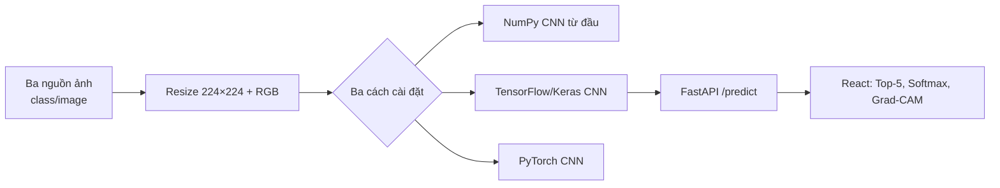

# Ma trận đáp ứng REQUIREMENTS.md

Tài liệu này là đường dẫn kiểm tra nhanh cho buổi bảo vệ. Các phần đánh dấu “chạy được” đều là mã nguồn trong repository, không chỉ là mô tả.

| Yêu cầu | Artefact kiểm tra | Cách minh hoạ |
|---|---|---|
| 1. Nạp dữ liệu ảnh | `model/dataset_raw/animals/animals`, các notebook huấn luyện | Ba notebook dùng chung một cấu trúc `class_name/image_file`; cấu hình tại cell `DATASET_DIR`. |
| 2a. Khám phá CNN | `/identify`, `client/src/components/cnn/` | Xem pipeline Input → Conv → Pool → Softmax → Grad-CAM và tab yêu cầu/mã nguồn ngay dưới demo. |
| 2b. Mô hình cải tiến | `/identify`, tab “Yêu cầu & dữ liệu” | So sánh VGG, ResNet và Inception theo ý tưởng, ưu/nhược, tình huống dùng. |
| 3. CNN từ đầu | `model/cnn_from_scratch.py` | Đặt breakpoint hoặc chạy lệnh; trình bày forward/backward của Conv2D, ReLU, MaxPool, GAP, Dense, Softmax. |
| 4. Keras/TensorFlow | `model/train_keras.ipynb`, `model/train_cnn.ipynb`, `model/main.py` | Huấn luyện/lưu `.keras`, FastAPI inference, Top-5 và Grad-CAM. |
| 5. PyTorch | `model/train_pytorch.ipynb` | Huấn luyện `AnimalCNN`, lưu state dict `.pt`. |

## Luồng dữ liệu

## CNN hoạt động như thế nào?

Một tensor ảnh RGB có dạng `H × W × 3`. Một kernel 3×3 quét qua ảnh; tại mỗi vị trí, Conv2D nhân từng phần tử kernel với vùng ảnh rồi cộng lại. ReLU giữ giá trị dương để tạo phi tuyến. MaxPooling giữ đặc trưng mạnh nhất trong ô 2×2, giảm kích thước. Cuối cùng Global Average Pooling và Dense tạo logits; Softmax đổi logits thành xác suất tổng bằng 1.

Trong `cnn_from_scratch.py`, `Conv2D.backward` tính gradient với kernel, bias và input bằng `einsum`; sau đó gradient đi ngược qua ReLU, MaxPool, GAP và Dense. Đây là phần tự định nghĩa phép tính, không gọi layer cao cấp.

## CNN cải tiến từ CNN

| Kiến trúc | Ý tưởng chính | Lợi ích | Đổi lại |
|---|---|---|---|
| VGG | Chồng nhiều Conv 3×3 | Dễ hiểu, đặc trưng sâu | Nhiều tham số, nặng. |
| ResNet | Nhánh tắt `F(x) + x` | Huấn luyện mạng rất sâu, giảm mất gradient | Phức tạp hơn CNN cơ bản. |
| Inception | Nhiều kernel 1×1/3×3/5×5 song song | Bắt đặc trưng đa tỉ lệ, hiệu quả tham số | Kiến trúc khó trình bày/cài đặt hơn. |

Mô hình production hiện tại được phục vụ từ `animal_image_classifier.keras`. Grad-CAM lấy gradient của lớp dự đoán theo feature map Conv cuối để tô vùng ảnh ảnh hưởng nhiều nhất; đó là giải thích hỗ trợ quan sát, không phải bằng chứng tuyệt đối rằng mô hình “hiểu” ảnh.

## Kịch bản demo 5 phút

1. Mở `/identify`, tải ảnh hoặc chọn preset, sau đó xem Top-5 và Grad-CAM.
2. Cuộn xuống các tab mã nguồn; chọn NumPy để chỉ vào hàm `forward` và `backward`.
3. Chọn Keras/PyTorch để trình bày hai notebook cùng dataset.
4. Đặt dataset tại `model/dataset_raw/animals/animals`, rồi chạy các cell Keras/PyTorch.
